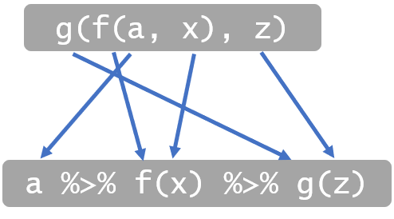

# Manipulasi Data Menggunakan R dan MySQL
Ini adalah catatan untuk memandu secara singkat dalam melakukan manipulasi/transformasi data menggunakan R dan beberapa package yang menjadi bagian dari package `tidyverse`. Tujuan dari tutorial ini adalah agar peserta dapat mencoba mengakses data yang berasal dari database (pada kesempatan ini menggunakan MySQL) dan dari file CSV yang dapat diunduh. Database yang akan diakses telah disediakan oleh pembicara di localhost-nya. Anda hanya dapat mengaksesnya ketika kegiatan sedang berlangsung. 

## 1. Prasyarat

Untuk dapat mengikuti tutorial ini dengan baik, ada beberapa hal yang perlu dipersiapkan oleh peserta. Yaitu:

1. Koneksi internet yang baik

2. Menginstall software

    a. R program <https://cran.r-project.org/>

    b. RStudio <https://www.rstudio.com/products/rstudio/download/>

3. Data & Script yang dapat diperoleh dari [repository ini](https://github.com/aephidayatuloh/dm_dplyr) dan pada database yang disediakan pembicara.

4. Package R yang dibutuhkan: `readr`, `tidyr`, `dplyr` (atau `tidyverse`) dan `RMySQL`

Jika Anda ingin mencoba diluar kegiatan, Anda dapat menginstall package `nycflights13` untuk memperoleh data yang digunakan pada database. 

```{r eval=FALSE}
install.packages("nycflights13")
library(nycflights13)
```


## 2. Install Packages

Jalankan perintah di bawah ini untuk install package (**jika Anda belum pernah install**) yang akan digunakan untuk dapat mengikuti tutorial ini sampai selesai.

```{r eval=FALSE}
install.packages(c("readr", "tidyr", "dplyr", "RMySQL"))
```

Panggil package yang sudah Anda install dengan fungsi `library()`.

```{r loadpkg}
# Panggil package yang sudah terisntall
library(RMySQL)
library(readr)
library(tidyr)
library(dplyr)
```

Package `reader`, `tidyr` dan `dplyr` (dan beberapa package lain yang tidak digunakan di tutorial ini, misalnya `ggplot2` untuk visualisasi) termasuk dalam bagian package `tidyverse`. `tidyverse` adalah kumpulan package yang dibuat oleh Hadley Wickham dkk untuk kebutuhan data science menggunakan R.

`RMySQL` digunakan untuk membuat koneksi antara R dan database MySQL. Beberapa fungsi yang akan digunakan pada tutorial ini antara lain `dbConnect()` yang berasal dari package `DBI` untuk membuat koneksi, `dbReadTable()` untuk import data dari database ke R dan fungsi `dbDisconnect()` untuk memutuskan koneksi yang sudah tidak digunakan.
`readr` berguna untuk import data dari tabular data file (csv, text file, dll).
`tidyr` memiliki fungi-fungsi untuk "merapihkan" data. Terutama yang sering digunakan adalah fungsi `gather()` dan `spread()`.
`dplyr` adalah package yang sangat berguna untuk melakukan manipulasi/transformasi data menggunakan R.

<p align="center">
    
    <br/>
    <br/>
    <em>Tidyverse</em>
</p>

## 3. Koneksi ke Database dan Import Data

Data diperoleh dari packages `nycflights13` yang disimpan ke dalam database dan berupa file CSV untuk disesuaikan dengan kebutuhan tutorial. 
Data ini terdiri dari 336,776 penerbangan dari New York City (NYC) selama tahun 2013. Data asli berasal dari US Bureau of Transportation Statistics, dan dapat dilihat dokumentasinya dengan `?nycflights13::flights`.


Untuk data yang tersedia di database Anda dapat membuat koneksi ke database dengan perintah berikut ini.

```{r db}
srv <- "localhost" # ganti dengan IP yang akan diberikan oleh pembicara
port <- 3306
dbn <- "nycflights"
usr <- "user1"
pwd <- "P@ssw0rd"

mycon <- dbConnect(MySQL(), 
                   host = srv, 
                   dbname = dbn, 
                   user = usr, 
                   password = pwd, 
                   port = port)
dbListTables(mycon)
flights <- as_tibble(dbReadTable(mycon, "flights"))
airlines <- as_tibble(dbReadTable(mycon, "airlines"))
airports <- as_tibble(dbReadTable(mycon, "airports"))
weather <- as_tibble(dbReadTable(mycon, "weather"))
planes <- as_tibble(dbReadTable(mycon, "planes"))
```

Penting untuk menutup koneksi ke database setelah selesai mengakses dan tidak menggunakan koneksi tersebut. Memutuskan koneksi dapat menggunakan fungsi `dbDisconnect(mycon)`.

Untuk data CSV yang akan digunakan dapat Anda unduh terlebih dahulu dan simpan di sebuah folder *working directory*, misalnya di dalam folder `D:/pelatihanR` dengan nama `prices.csv`. Untuk mengaktifkan *working directory* pada folder tersebut Anda dapat gunakan fungsi `setwd("D:/pelatihanR")`.

```{r eval=FALSE}
download.file(url = "https://raw.githubusercontent.com/aephidayatuloh/manipulasi-data/master/prices.csv", 
              destfile = "D:/pelatihanR/prices.csv")
download.file(url = "https://raw.githubusercontent.com/aephidayatuloh/manipulasi-data/master/specialdays.csv", 
              destfile = "D:/pelatihanR/specialdays.csv")

# Import data dari CSV tersebut ke R
prices <- read_delim("D:/pelatihanR/prices.csv", delim = ";")
specialdays <- read_csv("D:/pelatihanR/specialdays.csv")
```

Atau dengan cara langsung import tanpa unduh terlebih dahulu.
```{r}
prices <- read_delim("https://raw.githubusercontent.com/aephidayatuloh/dm_dplyr/master/prices.csv", delim = ";")

specialdays <- read_csv("https://raw.githubusercontent.com/aephidayatuloh/dm_dplyr/master/specialdays.csv")
```
File `prices.csv` dibaca menggunakan fungsi `read_delim()` karena pemisah antar variablenya adalah titik-koma (`:`), maka dari itu disebutkan juga `delim = ";"`. Untuk file `specialdays.csv` dibaca menggunakan fungsi `read_csv()` karena menggunakan tanda koma (`,`) sebagai pemisah antar variable.

* Keterangan data:
  + [`flights`](https://www.rdocumentation.org/packages/nycflights13/versions/1.0.0/topics/flights): semua penerbangan yang berangkat dari NYC di tahun 2013.
  + [`weather`](https://www.rdocumentation.org/packages/nycflights13/versions/1.0.0/topics/weather): data meteorologi per jam untuk masing-masing bandara (*airports*). 
  + [`planes`](https://www.rdocumentation.org/packages/nycflights13/versions/1.0.0/topics/planes): information tentang konstruksi masing-masing pesawat. 
  + [`airports`](https://www.rdocumentation.org/packages/nycflights13/versions/1.0.0/topics/airports): nama dan lokasi bandara. 
  + [`airlines`](https://www.rdocumentation.org/packages/nycflights13/versions/1.0.0/topics/airlines): translasi antara dua huruf kode `carrier` dan namanya.
  + [`prices`](): daftar harga tiket (`ticket`) dan biaya (`cost`) per penumpang untuk masing-masing penerbangan.
  + [`specialdays`](): daftar hari "istimewa" di Amerika.

Keterangan variable:

`flights`

| Variable | Keterangan |
|-------|------------|
| `year`,`month`,`day` | Date of departure |
| `dep_time`, `arr_time` | Actual departure and arrival times (format HHMM or HMM), local tz. |
| `sched_dep_time`, `sched_arr_time` | Scheduled departure and arrival times (format HHMM or HMM), local tz. |
| `dep_delay`, `arr_delay` | Departure and arrival delays, in minutes. Negative times represent early departures/arrivals. |
| `hour`, `minute` | Time of scheduled departure broken into hour and minutes. |
| `carrier` | Two letter carrier abbreviation. See `?airlines` to get name. |
| `tailnum` | Plane tail number |
| `flight` | Flight number |
| `origin`, `dest` | Origin and destination. See `?airports` for additional metadata. |
| `air_time` | Amount of time spent in the air, in minutes. |
| `distance` | Distance between airports, in miles. |
| `time_hour` | Scheduled date and hour of the flight as a `POSIXct` date. Along with origin, can be used to join `flights` data to `weather` data. |
| | |

`airlines`

| Variable | Keterangan |
|-------|------------|
| `carrier` | Two letter abbreviation |
| `name` | Full name |
| | |

`planes`

| Variable | Keterangan |
|-------|------------|
| `tailnum` | Tail number |
| `year` | Year manufactured |
| `type` | Type of plane |
| `manufacturer`,`model` | Manufacturer and model |
| `engines`,`seats` | Number of engines and seats |
| `speed` | Average cruising speed in mph |
| `engine` | Type of engine |
| | |

`weather`

| Variable | Keterangan |
|-------|------------|
| `origin` | Weather station. Named origin to faciliate merging with `flights` data. |
| `year`,`month`,`day`,`hour` | Time of recording. |
| `temp`,`dewp` | Temperature and dewpoint in Fahrenheit. |
| `humid` | Relative humidity. |
| `wind_dir`,`wind_speed`,`wind_gust` | Wind direction (in degrees), speed and gust speed (in mph). |
| `precip` | Precipitation, in inches. |
| `pressure` | Sea level pressure in millibars. |
| `visib` | Visibility in miles |
| `time_hour` | Date and hour of the recording as a `POSIXct` date. |
| | |

`airports`

| Variable | Keterangan |
|-------|------------|
| `faa` | FAA airport code. |
| `name` | Usual name of the aiport. |
| `lat`,`lon` | Location of airport. |
| `alt` | Altitude, in feet. |
| `tz` | Timezone offset from GMT. |
| `dst` | Daylight savings time zone. A = Standard US DST: starts on the second Sunday of March, ends on the first Sunday of November. U = unknown. N = no dst.|
| `tzone` | IANA time zone, as determined by GeoNames webservice |
| | |

`prices`

| Variable | Keterangan |
|-------|------------|
| `year`,`month`,`day` | Date of departure |
| `origin`,`dest` | Origin and destination. See `?airports` for additional metadata. |
| `sched_dep_time` | Scheduled departure and arrival times (format HHMM or HMM), local tz. |
| `tailnum` | Plane tail number |
| `ticket` | Average ticket price per person for a flight |
| `cost` | Average operating costs per person for a flight |
| | |

`specialdays`

| Variable | Keterangan |
|-------|------------|
| `year`,`month`,`day` | Date of departure |
| `holiday` | Name of special day in United States |
| | |

## 3. Cakupan Materi
Materi yang akan dibahas:

| Fungsi/Operator | Materi |
|--------|----------------|
| `distinct()` | Mendapatkan nilai unik/tidak duplikat dari data frame atau variable |
| `select()` | Subset variable berdasarkan nama/indeks variable |
| `slice()` atau `filter()` | Subset baris berdasarkan indeks baris atau nilai dari satu atau beberapa variabel |
| `arrange()` | Mengurutkan sebuah data frame berdasarkan satu atau beberapa variable |
| `na_if()`,`drop_na()`,`replace_na()` | Penanganan Na (*missing value*) |
| `%>%` | Operator Pipes untuk beberapa fungsi secara berurutan/*sequence* |
| `mutate()` | Membuat variabel baru/menghitung dari variabel yang sudah ada |
| `count()` dan `spread()` | Tabel frekuensi dan transformasi tabel |
| `summarise()` dan `group_by()` | Ringkasan (*summary*) variabel atau berdasarkan group |
| `inner_join()` dan `left_join()` | Merge/Join tabel |
| | |

## 4. Materi

Setelah berhasil import data dari MySQL dan CSV, selanjutnya kita akan mengeksplorasi data tersebut.

```{r}
dim(flights)
glimpse(flights)
head(flights)
summary(flights)
```

`dim()` menampilkan banyaknya baris dan variable dari suatu data frame.

`glimpse()` serupa dengan `str()` dari base-R, bertujuan untuk melihat tipe dan struktur objek. Jika objek tersebut adalah data frame, maka akan menghasilkan banyaknya baris (**observations**) dan variable (**variables**). Fungsi ini juga menampilkan nama variabel, tipe variabel, dan beberapa baris pertama dari data.

`head()` berguna untuk melihat atau menampilkan beberapa baris pertama dari data frame. Secara default `head()` menggunakan `n = 6` untuk menentukan banyaknya baris yang akan ditampilkan. Jika Anda ingin melihat 10 baris pertama, maka cukup mennggantinya menjadi `head(flights, n = 10)`. Namun jika yang ingin Anda tampilkan ada beberapa baris terakhir dari data frame, gunakan `tail()`.

`summary()` menghasilkan beberapa nilai statistik deskriptif untuk masing-masing variabel jika yang dimasukan sebagai argumen adalah data frame. Untuk variabel numerik maka akan menhasilkan nilai minimum (`Min.`), quantil pertama (`1st Qu.`), median (`Median`), rata-rata (`Mean`), quantil ketiga (`3rd Qu.`), maksimum (`Max.`) dan banyaknya missing value (`NA's`) jika ada. Untuk variabel kategorik (*character* atau *factor*) makan akan menghasilkan banyaknya data (`Length`), kelas (`Class`) dan mode (`Mode`).

### 4.1. Mengambil nilai unik (tidak duplikasi) dari sebuah variable
Hal ini sama seperti melakukan `remove duplicate` di Ms Excel untuk satu variabel.

```{r}
distinct(flights, year)

distinct(flights, origin)

distinct(flights, dest)

```

Untuk mendapatkan nilai unik dari semua baris berdasarkan variabel tertentu tambahkan opsi `.keep_all = TRUE` setelah nama variable dalam fungsi `distinct()`.

```{r}
distinct(flights, dest, .keep_all = TRUE)

distinct(flights)
```

### 4.2. Memilih atau membuang beberapa variable yang akan/tidak digunakan


Untuk membuat data frame dari hasil `select()` Anda dapat menuliskan `namadataframe <- select(...)`. Argumen pertama dari `select()` adalah data frame yang ingin kita subset variabel tertentu saja. Selanjutnya tuliskan nama variable yang Anda inginkan ada di data frame yang baru. Anda dapat menuliskan nama masing-masing variable atau dapat juga dengan menuliskan urutan (indeks) variabel.

```{r}
select(flights, month, day, dep_time, dep_delay, arr_time, arr_delay, origin, dest)
select(flights, c(2:4, 6:7, 9, 13:14))
```

Jika variabel yang ingin Anda pilih cukup banyak sedangkan variabel yang ingin Anda buang lebih sedikit, Anda dapat menuliskan nama variabel dengan menambahkan tanda negatif (`-`) di depan nama atau indeks masing-masing variabel.

```{r}
select(flights, -year)
select(flights, -1)
```

### 4.3. Memilih baris data berdasarkan indeks baris atau nilai pada variabel tertentu
Ketika Anda ingin memilih sebagian baris saja dari data frame, Anda dapat menggunakan fungsi `slice()` atau `filter()`.

`slice()` berfungsi untuk mensubset baris data berdasarkan indeks barisnya. Misalkan, `slice(flights, 1:100)` berarti Anda memilih data pada posisi baris ke-1 s/d ke-100. Posisi baris 1:100 adalah vector numerik integer yang ingin dipilih. 

```{r}
# memilih baris ke-1 s/d 1000
slice(flights, 1:1000)
```

`filter()` berfungsi untuk memilih sebagian data berdasarkan nilai dari satu atau lebih variabel.

```{r}
filter(flights, dep_delay >= 10)
filter(flights, dep_delay >= 10 & origin == "JFK")
filter(flights, month == 1 & day == 1 & origin == "JFK" & dest == "ATL")
filter(flights, is.na(dep_time))
```

### 4.4. Mengurutkan data

Mengurutkan data frame menggunakan fungsi `arrange()` sangat mudah. 
```{r}
# Urutkan data frame flights berdasarkan variabel `origin`
arrange(flights, origin)

# Urutkan data frame flights berdasarkan variabel `origin` dan `dest`
arrange(flights, origin, dest)

# Urutkan data frame flights berdasarkan variabel `origin` secara ascending dan `dest` secara descending
arrange(flights, origin, desc(dest))
```

### 4.5. Penanganan *missing values*

Untuk kebutuhan ilustrasi pada bagian ini dengan fungsi `na_if()`, Anda akan mengganti nilai NA (*missing value*) menjadi sebuah nilai tertentu, misalnya jika `air_time` missing akan diganti menjadi nilai `-999`.

```{r}
# Banyaknya NA
sum(is.na(flights["air_time"]))

flights_na999 <- flights
# Merubah NA dengan -999
flights_na999$air_time <- if_else(is.na(flights$air_time), -999, flights$air_time)

# Banyaknya NA
sum(is.na(flights_na999["air_time"]))

# Banyaknya NA yang sudah diganti -999
sum(flights_na999["air_time"] == -999)
```

```{r}
# Ganti nilai NA menjadi -999
flights_na999$air_time <- na_if(flights_na999$air_time, -999)

# Banyaknya -999
filter(flights_na999, air_time == -999)

# Banyaknya NA
sum(is.na(flights_na999$air_time))

# Membuang semua baris yang mengandung NA
flights_NoNA <- drop_na(flights)

# Mengganti NA pada masing-masing variabel dengan nilai tertentu
replace_na(flights, list(dep_time = 0, dep_delay = 0, arr_time = mean(flights$arr_time, na.rm = TRUE), arr_delay = median(flights$arr_delay, na.rm = TRUE)))
```

Fungsi `replace_na()` menggunakan argumen sebuah `list` untuk menentukan nilai pengganti NA pada sebuah variabel. Dari contoh di atas, NA pada `dep_time` dan `dep_delay` diganti menjadi 0 (nol), NA di `arr_time` diganti dengan rata-rata `arr_time`, sedangkan NA di `arr_delay` diganti dengan nilai median dari `arr_delay`.

### 4.6. Operator Pipes *`%>%`*

Seringkali proses *data preparation* membutuhkan banyak proses atau tahapan. Sekarang jika kita ingin melakukan beberapa proses sekaligus, salah satunya kita akan membuat script kurang lebih seperti ini.

```{r}
selected <- select(flights, dep_delay, arr_time, arr_delay, origin, dest, air_time)
filtered <- filter(selected, dep_delay >= 10 & origin == "JFK")
hasil <- arrange(filtered, origin)
hasil
```

Atau ada juga yang menuliskan seperti berikut ini.

```{r}
hasil <- arrange(filter(select(flights, dep_delay, arr_time, arr_delay, origin, dest, air_time), dep_delay >= 10 & origin == "JFK"), origin)
hasil
```

Jika Anda diminta untuk mempelajari script seperti ini saya cukup yakin bahwa Anda akan merasa kesulitan untuk mengetahui proses yang akan dilakukan oleh script tersebut. Script di atas masih sederhana, hanya ada tiga fungsi. Bayangkan jika banyak fungsi yang digunakan secara berurutan, bentuk di atas akan menjadi:

```{r eval=FALSE}
output <- fun_n(...(fun3(fun2(fun1(dataframe, arg1), arg2), arg3), ...), arg_n)
```

Jika diperhatikan, argumen pertama dari masing-masing fungsi `select()`, `filter()`, `arrange()` dan beberapa fungsi yang lain di `dplyr` yang sering digunakan untuk transformasi dan eksplorasi data adalah data frame/**tibble** atau hasil dari proses sebelumnya. Misalnya, hasil dari fungsi `select()` adalah data frame yang kemudian diproses dengan fungsi `filter()` untuk memilih baris data tertentu dan hasilnya diteruskan lagi ke fungsi `arrange()` untuk diurutkan berdasarkan variabel tertentu.

Dengan konsep `tidyverse`, kita dapat menggunakan operator Pipes `%>%` agar lebih mudah dalam memahami script karena script tersebut menunjukkan urutan. Perhatikan contoh di bawah ini.

```{r}
flights %>% 
  select(dep_delay, arr_time, arr_delay, origin, dest, time_hour) %>% 
  filter(origin == "JFK" & between(dep_delay, -10, 100)) %>% 
  arrange(origin, desc(dest)) 
```

Jika dibuat ke dalam kalimat:

> "Ambil data penerbangan dari data frame `flights` dengan membuang semua baris yang minimal ada satu variabel yang mempunyai nilai NA, kemudian pilih variabel-variable tertentu saja. Selanjutnya filter yang `origin`-nya dari "JFK" dan waktu keberangkatan antara yang lebih awal 10 menit dan yang delay hingga 100 menit. Kemudian urutkan hasil tersebut berdasarkan `origin` secara *ascending* dan berdasarkan `dest` secara *descending*."


#### 4.6.1. Penjelasan Operator Pipes `%>%`

Saya akan coba menjelaskan lebih dalam untuk lebih memahami oprator `%>%`.

Misalkan `f(a, x)` adalah sebuah fungsi di R dengan argumen `a` dan `x`. kemudian fungsi `g(b, z)` adalah fungsi lain di R dengan argumen `b` dan `z`. Dengan menggunakan operator `%>%` kita dapat menuliskannya sebagai berikut.

```{r eval=FALSE}
# fungsi f(a, x)
f(a, x) # atau
a %>% f(x)

# fungsi g(b, z)
g(b, z) # atau
b %>% g(z)
```

Dari kedua contoh di atas, dapat dilihat bahwa `a` adalah argumen pertama untuk fungsi `f()` dan `b` adalah argumen pertama untuk fungsi `g()`. Operator `%>%` "menyampaikan" objek `a` sebagai nilai untuk mengisi argumen pertama pada fungsi `f()`. Perhatikan ilustrasi di bawah ini.

<p align="center">
    
    <br/>
    <br/>
    <em>Ilustrasi Pipes 1</em>
</p>

Misalkan objek `a` menjadi argumen pertama fungsi `f()` dengan `a %>% f(x)`. Kemudia hasil dari `a %>% f(x)` dijadikan argumen pertama dari fungsi `g()`. Dengan kata lain `b <- a %>% f(x)` sehingga `b %>% g(z)`. Hal ini dapat dilakukan secara berurutan dengan operator `%>%` sebagai berikut.

```{r eval=FALSE}
a %>%
    f(x) %>%
    g(z)
```

<p align="center">
    
    <br/>
    <br/>
    <em>Ilustrasi Pipes 2</em>
</p>

> "Fungsi `f()` diterapkan terhadap objek `a` sebagai argumen pertama dan `x` sebagai argumen kedua dari fungsi `f()` yang kemudian hasilnya digunakan sebagai argumen pertama pada fungsi `g()` dengan `z` sebagai argumen kedua."

Selanjutnya kita akan gunakan operator `%>%` dalam tutorial ini.

### 4.7. Membuat variabel baru

```{r}
flights %>% 
  select(dep_delay, arr_time, arr_delay, origin, dest, time_hour) %>% 
  filter(origin == "JFK" & between(dep_delay, -10, 100)) %>% 
  arrange(origin, desc(dest)) %>% 
  mutate(is_delay = if_else(dep_delay > 0, 1, 0),
         time_hour = as.POSIXct(time_hour))

```
Jika dibuat ke dalam kalimat:

> "Ambil data penerbangan dari data frame `flights` dengan membuang semua baris yang minimal ada satu variabel yang mempunyai nilai NA, kemudian pilih variabel-variable tertentu saja. Selanjutnya filter yang `origin`-nya dari "JFK" dan waktu keberangkatan antara yang lebih awal 10 menit dan yang delay hingga 100 menit. Kemudian urutkan hasil tersebut berdasarkan `origin` secara *ascending* dan berdasarkan `dest` secara *descending*. Setelah itu membuat variabel baru bernama `is_delay` yang menunjukkan apakah suatu penerbangan terjadi *delay* atau tidak. Kemudian konversi variable `time_hour` yang masih bertipe `character` menjadi `datetime` atau *`<dttm>`* dengan nama variabel yang sama, yaitu `time_hour`."

### 4.8. 	Tabel frekuensi dan transformasi tabel

Membuat tabel frekuensi berdasarkan `origin` dan `dest`. Gunakan fungsi `count()` untuk mengetahui banyaknya baris.

```{r}
flights %>%
  count()

flights %>% 
  count(origin, dest)

flights %>% 
  mutate(is_delay = dep_delay > 0) %>% 
  count(origin, is_delay) %>%
  spread(key = origin, value = n)

```

+ Membuang NA dengan `drop_na()` dan menghitung rata-rata *delay*.
```{r}
flights %>% 
  drop_na() %>% 
  summarise(rata2_delay = mean(dep_delay))

```

+ Membuat tabel frekuensi berdasarkan `origin` dan `dest`.
```{r}
flights %>% 
  group_by(origin, dest, month) %>% 
  summarise(rata2_delay = mean(dep_delay, na.rm = TRUE)) %>% 
  arrange(rata2_delay) 

```

#### 4.9. Ringkasan (*summary*) dan Group

`group_by()` dan `summarise()` digunakan untuk menghitung statistik berdasarkan grup yg disebutkan pada fungi `group_by()`. 

```{r}
flights %>% 
  group_by(origin, dest) %>% 
  summarise(rata2_delay = mean(dep_delay, na.rm = TRUE))
```
Hasil dari `summarise()` adalah sebuah data frame/tibble. Maka dari itu, sebaiknya berikan nama pada hasil `summarise()`. `rata2_delay` adalah nama variabel hasil dari `mean()`.

```{r}
flights %>% 
  group_by(origin, dest) %>% 
  summarise(rata2_delay = mean(dep_delay, na.rm = TRUE)) %>% 
  spread(key = origin, value = rata2_delay) # soon replaced with pivot_wider()
```
`spread()` membuat variabel baru dari isi sebuah variabel yang disebutkan pada argumen `key =` sebagai nama variabel, dan nilai dari variabel-variabel baru tersebut adalah nilai dari variabel yang disebutkan di argumen `value =`.

**Note:** pada saat tutorial ini dibuat, package `tidyr` masih menggunakan fungsi `spread()` dan `gather()` untuk transformasi data frame. Namun pembuat package `tidyr` sudah berencana untuk menggantinya dengan nama fungsi baru, yaitu `pivot_wider()` dan `pivot_longer()`.

```{r}
flights %>% 
  group_by(origin, dest) %>% 
  summarise(rata2_delay = mean(dep_delay, na.rm = TRUE)) %>% 
  spread(key = origin, value = rata2_delay) %>% # soon replaced with pivot_wider()
  gather(key = origin, value = rata2_delay, -dest) # soon replaced with pivot_longer()
```

```{r}
tb <- flights %>%
  group_by(month) %>% 
  count()

plot(tb$month, tb$n, "l")


tb <- flights %>%
  group_by(day) %>% 
  count()

plot(tb$day, tb$n, "l")


tb <- flights %>%
  mutate(dates = as.Date(paste(year, month, day, sep = "-"), format = "%Y-%m-%d")) %>%
  group_by(dates) %>% 
  count()
plot(tb$dates, tb$n, "l")

```

Fungsi `paste` berfungsi untuk menggabungkan (*concate*) dua buah nilai atau vector menjadi *character* dengan pemisah antar nilai tersebut adalah <spasi>. Misalnya 
```{r}
paste("nilai ini", 9)
```

Untuk mengganti pemisahnya Anda dapat menyebutkannya pada argumen `sep =`. Misalnya Anda ingin menggunakan pemisah tanda `-`, maka 
```{r}
paste("nilai ini", 9, sep = "-")
```
Fungsi `as.Date()` melakukan konversi dari sebuah character menjadi nilai tanggal (*date-value*) di R. Format tanggal default di R adalah `yyyy-mm-dd`, namun di R menggunakan format `%Y-%m-%d` untuk `2019-05-10`. Selebihnya Anda dapat melihatnya dengan `?as.Date`.

### 4.10. Merge/Join Tabel

Dalam dunia nyata, terutama di dunia kerja dan perusahaan, jarang sekali data yang digunakan hanya berasal dari satu tabel atau file. Biasanya ada tabel-tabel lain yang harus digunakan untuk mendukung analisis data. Misalnya di bank, di database minimal ada tabel `master_customer` yang berisi data demografi (nama, tempat & tanggal lahir, alamat, dst), dan `transaction` yang berisi data transaksi nasabah.

Pada bagian tutorial ini, akan membahas penggunaan beberapa tabel yang sudah dijelaskan di bagian awal mengenai data. Ada 7 dataset yang dapat digunakan. Mungkin untuk melakukan analisis dan mendapatkan hasilnya Anda tidak membutuhkan semuanya.

Dari ketujuh tabel, relasinya digambarkan seperti gambar di bawah ini.

<p align="center">
    
    <br/>
    <br/>
    <em>Diagram Relasi Tabel</em>
</p>

+ `flights` dihubungkan dengan `planes` via satu variabel, `tailnum`.

+ `flights` dihubungkan dengan `airlines` melaui variabel `carrier`.

+ `flights` dihubungkan dengan `airports` dengan dua cara: via variabel `origin` dengan variabel `faa` dan `dest` dengan variabel `faa`.

+ `flights` dihubungkan dengan `weather` via `origin` (lokasi), dan `year`, `month`, `day` dan `hour`.

+ `flights` dihubungkan dengan `prices` via `year`, `month`, `day`, `hour`, `flight`, `origin`, `dest`, `sched_dep_time`, dan `tailnum`.

+ `flights` dihubungkan dengan `specialdays` via variabel `year`, `month`, dan `day`.

Berikut fungsi untuk merge/join menggunakan package `dplyr` dan perbandingannya dengan SQL.

|dplyr|SQL|
|---|-----|
|`inner_join(x, y, by = c("a" = "b")` |`SELECT * FROM x INNER JOIN y ON x.a = y.b`|
|`left_join(x, y, by = c("a" = "b"))` |`SELECT * FROM x LEFT OUTER JOIN y ON x.a = y.b`|
|`right_join(x, y, by = c("a" = "b"))` |`SELECT * FROM x RIGHT OUTER JOIN y ON x.a = y.b`|
|`full_join(x, y, by = c("a" = "b"))` |`SELECT * FROM x FULL OUTER JOIN y ON x.a = y.b`|
| | |

**Catatan:** "INNER" dan "OUTER" pada SQL adalah opsional, dan lebih sering tidak dituliskan.

Berikut ilustrasi untuk menjelaskan merge/join.

Misalkan ada dua buah tabel, `x` dan `y` yang masing-masing mempunyai 2 variabel seperti pada gambar di bawah ini. Variabel pertama adalah **key** dan variabel kedua adalah **val**. 

<p align="center">
    
    <br/>
    <br/>
    <em>Tabel x dan y</em>
</p>

#### 4.10.1. Inner Join

Ketika melakukan proses `inner_join` maka akan diambil nilai yang sama dari **key** yang digunakan dari kedua tabel tersebut. Pada ilustrasi di bawah ini, digunakan `inner_join` untuk menggabungkan tabel `x` dan `y`. Dari kedua tabel tersebut, nilai **key** yang ada di tabel `x` dan `y` adalah 1 dan 2. Maka hasilnya adalah diambil baris data yang sama di kedua tabel tersebut, yaitu nilai **key** 1 dan 2.

```{r eval=FALSE}
x %>% 
  inner_join(y, by = "key")
```

Jika ada variabel lain selain key yang namanya sama, maka dibelakang masing-masing nama variabel tersebut akan ditambahkan `suffix`. `suffix` secara default adalah `suffix = c(".x", ".y")`. Artinya karena di masing-masing tabel ada variabel yang sama dan variabel ini bukan sebuah **key** pada saat join, yaitu `val`, maka setelah proses join nama `val` akan diganti menjadi `val.x` untuk variabel yang berasal dari tabel `x` dan `val.y` yang berasal dari tabel `y`.

Jika ingin mengganti `suffix`, Anda dapat menggunakan argumen `suffix` pada fungsi join.

```{r eval=FALSE}
x %>% 
  inner_join(y, by = "key", suffix = c("_x", "_y"))
```

<p align="center">
    
    <br/>
    <br/>
    <em>Ilustrasi Inner Join</em>
</p>

```{r}
tbl1 <- flights %>%
    inner_join(weather, by = c("year", "month", "day", "hour", "origin", "time_hour"))
glimpse(tbl1)
head(tbl1)
```

Karena semua variabel yang namanya sama di data frame `flights` dan `weather` digunakan sebagai **key** maka tidak ada variabel yang ditambahkan `suffix`.

#### 4.10.2. Left, Right and Full Outer Join

Perhatikan ilustrasi untuk left, right, dan full outer join.

<p align="center">
    
    <br/>
    <br/>
    <em>Ilustrasi Left, Right dan Full Outer Join</em>
</p>

Pada kesempatan ini hanya akan dibahas mengenai left join. Pada dasarnya `left_join()` mengambil semua baris yang ada di tabel sebelah kiri (LHS), dalam ilustrasi di atas adalah tabel `x`, dan mencari nilai yang ada pasangannya di tabel sebelah kanan (RHS), yaitu tabel `y`.

Jika nilai dari variabel **key** di tabel `x` tidak ada pasangannya di tabel `y` maka nilai **val** untuk baris tersebut akan menjadi *missing value* atau NA.

```{r}
tbl2 <- flights %>%
    left_join(airports, by = c("origin" = "faa")) %>%
    left_join(airports, by = c("dest" = "faa"), suffix = c("_origin", "_dest"))
glimpse(tbl2)
head(tbl2)
```

Jika diperhatikan, ada beberapa variabel dari `tbl2` yang namanya menggunakan `_origin` dan `_dest`. Hal ini menunjukkan ada variabel yang namanya sama dari hasil `left_join()` pertama dan kedua, yaitu nama variabel dari data frame `airports`. Karena dua kali join maka akan ada nama variabel yang sama sehingga namanya ditambahkan `suffix`.

## 5. Latihan
Buatlah analisis data untuk kebutuhan berikut!

1. Penerbangan dengan keterlambatan kedatangannya dua jam atau lebih.
2. Perbandingan penerbangan ke Houston (`IAH` atau `HOU`) berdasarkan bandara asalnya per bulan. 
  Hint: Anda dapat gunakan operator `%in%`. 
3. Penerbangan dioperasikan oleh United, American, atau Delta. 
  Hint: Anda dapat gunakan operator `%in%`.
4. Penerbangan di musim panas (July, August, and September). 
  Hint: Anda dapat gunakan fungsi `between()`.
5. Kedatangan yang terlambat datang lebih dari dua jam, tetapi tidak berangkat terlambat.
6. Penerbangan yang *delay* paling tidak satu jam, tetapi terbang lebih dari 30 menit.
7. Penerbangan yang berangkat antara tengah malam dan jam 6 pagi (*inclusive*).
8. Berapa banyak penerbangan yang nilai `tailnum`-nya missing? Apa maksud dari baris-baris data ini?
9. Berapa banyak penerbangan yang nilai `dep_time`-nya missing? Variable apalagi selain itu yang missing? Apa maksud dari baris-baris data ini?
10. Bagaimana hubungan penerbangan *delay* dikarenakan cuaca dan kondisi pesawat?

<p align="center">
<strong>----------------------- Semoga Bermanfaat -----------------------</strong>
</p>

**Contact me:**
**Aep** Hidayatuloh

Email: <aephidayatuloh.mail@gmail.com>
GitHub: <https://github.com/aephidayatuloh>


